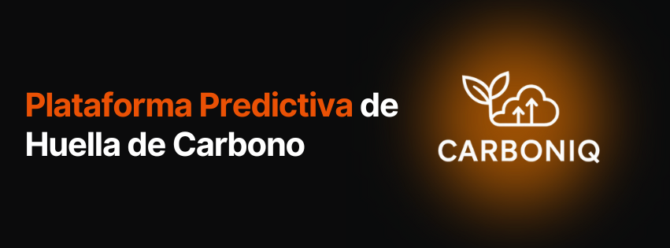
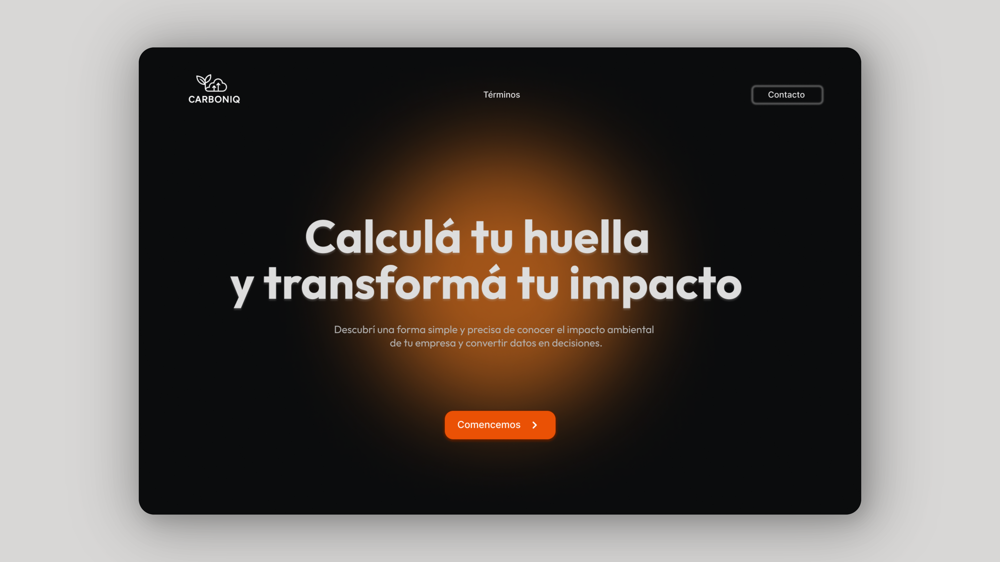
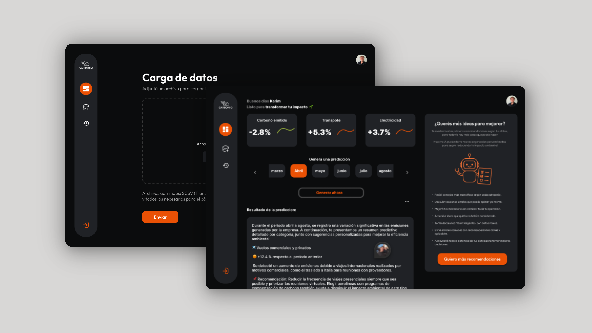
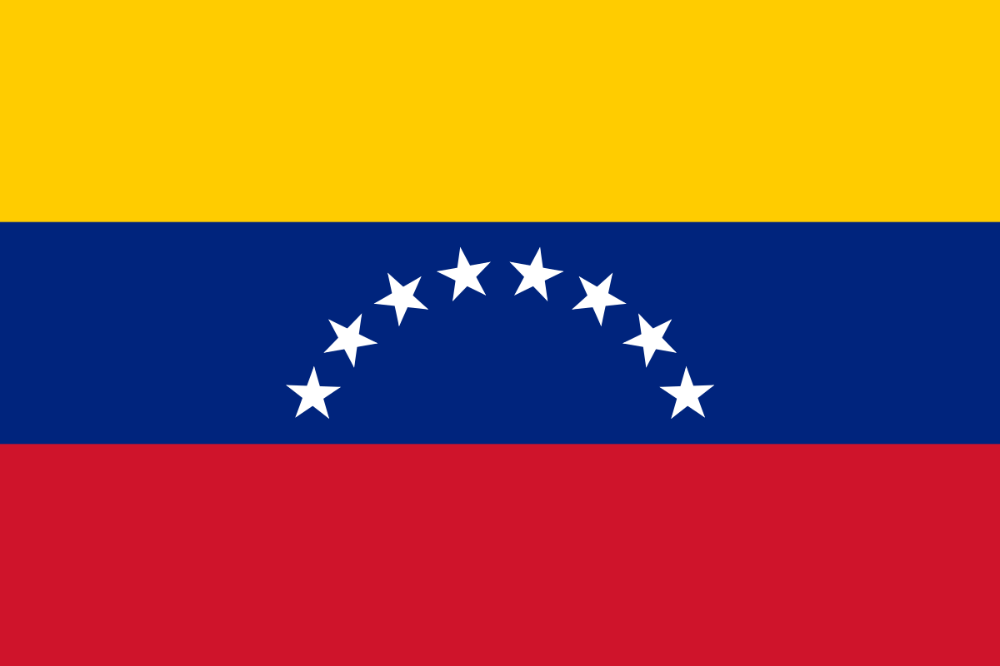

# 🌱 CarbonIQ | Plataforma Predictiva de Huella de Carbono

**CarbonIQ** es una plataforma digital diseñada para empresas medianas y grandes que desean conocer, analizar y reducir su impacto ambiental. A través del uso de inteligencia artificial, permite procesar datos de consumo y generar predicciones y recomendaciones inteligentes sobre la huella de carbono.

---

## 🎯 Objetivo

Facilitar la toma de decisiones sostenibles al ofrecer análisis automáticos y visualizaciones claras de los datos de consumo ambiental de cada empresa.

---

## ❗ Problema y Solución

- **Problema Identificado:** Las empresas carecen de herramientas accesibles, visuales y predictivas que les permitan anticipar y reducir su impacto ambiental de forma eficiente.

- **Nuestra Solución:** CarbonIQ entrega una solución intuitiva y poderosa. Permite cargar datos, analizar tendencias, visualizar comparativas y recibir sugerencias automáticas de optimización, todo bajo una interfaz moderna en modo oscuro.

---

## ✨ Características Destacadas

- 📁 **Carga de archivos SCSV mensual y anual**
- 🔮 **Predicciones automáticas por IA**
- 🧠 **Recomendaciones inteligentes por categoría (transporte, agua, gas, electricidad, vuelos)**
- 📊 **Visualización de comparativas por períodos**
- 🌚 **Diseño atractivo en modo oscuro**
- 👥 **Probado con usuarios sin experiencia técnica, con resultados positivos**

---

## 🔁 Flujo del Usuario

1. **Inicio de sesión o registro**
2. **Carga de archivo de consumo**
3. **Análisis y visualización automática**
4. **Visualización de comparativas y recomendaciones**
5. **Análisis en Dashboard**

---

## 🎨 Design UI

---

## 🧠 Tecnologías Utilizadas

### **🎨 UX/UI Design:**

### **🤖 Inteligencia Artificial:**

### **🖥️ Frontend:**

### **⚙️ Backend:**

### **🔧 Herramientas y Librerías:**

---

### **📌 Enlaces del Proyecto**

---

## 🤝 Nuestro Equipo

<table align="center">
  <tr>
    <td align="center">Luis Quispe </td>
    <td align="center">José Mora </td>
    <td align="center">Christian Aránguiz </td>
    <td align="center">Karim Jalit </td>
    <td align="center">Caleb Seña </td>
  </tr>
  <tr>
    <td align="center">PM & Front-End</td>
    <td align="center">Full Stack</td>
    <td align="center">Front-End</td>
    <td align="center">Design UX/UI</td>
    <td align="center">Back-End</td>
  </tr>
  <tr>
    <td align="center">
      
    </td>
    <td align="center">
      
    </td>
    <td align="center">
      
    </td>
    <td align="center">
      
    </td>
    <td align="center">
      
    </td>
  </tr>
</table>

---
